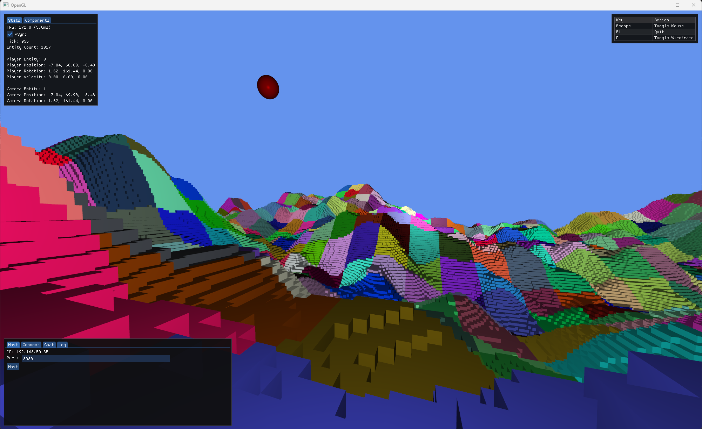
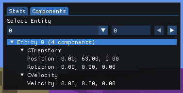

# OpenGL Playground  Real-Time Rendering, Game Architecture, ECS & Networking

This repository is a personal learning / showcase project exploring and implementing core concepts in:

- Modern **OpenGL** rendering (GLFW + glad + GLM)
- **Game loop & modular engine-style architecture**
- A custom, **high-performance Entity Component System (ECS)**
- **Multiplayer networking** (client/host, packet serialization, real-time sync)
- **ImGui** driven in-engine tooling / debug UI

---
## High-Performance ECS Overview
The project implements a custom ECS focused on: 

- O(1) average Add / Remove / Get for components
- Tight, cache-friendly contiguous storage per component type
- Zero virtual calls in hot paths (compile-time dispatch + type erasure only at registration)
- Fast multi-component iteration via a heuristic (iterate the *smallest* involved component pool)
- Low fragmentation, stable `Entity` identifiers (recycled indices) & optional owning `EntityHandle`
- Header-only, no external dependency

### Complexity (Amortized)
- Create entity: `O(1)`
- Destroy entity: `O(k)` where `k` = number of components on that entity
- Add component: `O(1)` (append + sparse map write; potential `vector` reallocation)
- Remove component: `O(1)`
- Get / Has: `O(1)`
- View iteration `(T1...Tn)`: `O(|SmallestPool| + Skips)`  (skip cost is cheap sparse check)

### Benchmark Results

| Test Case                                | Custom ECS (ms) | EnTT (ms) | Speedup (EnTT/Custom) |
|------------------------------------------|----------------:|----------:|----------------------:|
| Add/Remove (25% of entities)             | 7.843           | 11.308    | 1.44×                 |
| Add/Remove + Zero Component              | 4.442           | 6.320     | 1.46×                 |
| Create + Destroy Entities (50k per run)  | 0.867           | 2.847     | 3.28×                 |
| Iterate (single component)               | 4.651           | 4.913     | 1.06×                 |
| Iterate (single, read-only)              | 3.945           | 4.723     | 1.20×                 |
| Iterate (two components)                 | 7.147           | 8.675     | 1.22×                 |
| Iterate (two components, branchy)        | 24.463          | 33.289    | 1.35×                 |
| Iterate (two components, dual write)     | 7.516           | 9.442     | 1.25×                 |
| Iterate (three components, 0% present)   | 0.000           | 0.000     | 1.00×                 |
| Iterate (three components, 25% present)  | 2.250           | 2.887     | 1.29×                 |
| Iterate (three components, 50% present)  | 6.028           | 7.930     | 1.30×                 |
| Iterate (three components, 75% present)  | 3.517           | 4.514     | 1.28×                 |
| Iterate (three components, 100% present) | 3.790           | 5.063     | 1.33×                 |
| Random Destroy + Create (10k per run)    | 3.263           | 5.645     | 1.73×                 |
| Random Get (1k+ ops)                     | 0.070           | 0.262     | 3.71×                 |

---
## Rendering & Engine Structure
High-level modules (directory names may vary slightly):

- Core: Application, Window, Layer system, Timestep abstraction, GUI integration.
- Renderer: Shader, Texture, Mesh utilities, VAO/VBO management.
- Entity: ECS (Registry + component definitions).
- World / Game: Higher-level orchestration (world state, spawning, gameplay logic).
- Events: Decoupled event base + specific network/game events.
- Network: Host & Client, packet serialization / dispatch.
- GUI: ImGui manager for debug overlays & tweaking.

---
## Networking Overview
- Client / host roles separated (`NetworkHost`, `NetworkClient`).
- Packet layer: explicit packet struct(s) & serialization.
- Event system integration for decoupled propagation to gameplay / UI.

---
## Demo
Overview:

Entity Debug Menu:

Multiplayer (LAN/Online):

---
## Learning References
- [docs.GL](http://docs.gl/#)
- [LearnOpenGL](https://learnopengl.com/Introduction)
- [Learning Modern 3D Graphics Programming](https://nicolbolas.github.io/oldtut/)
